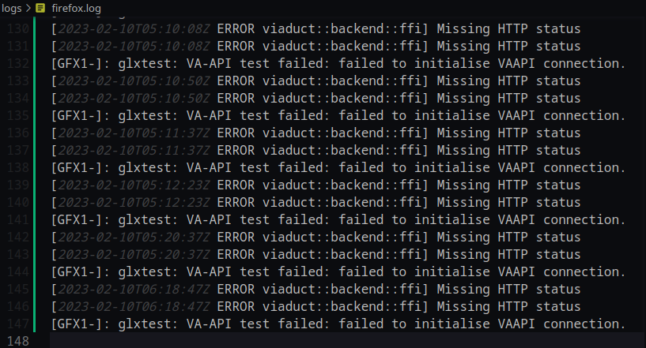
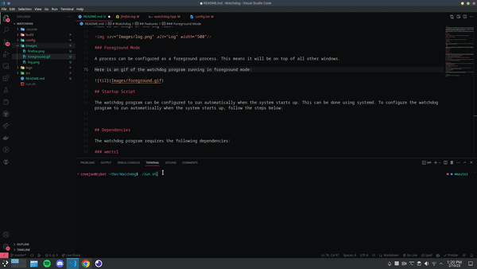
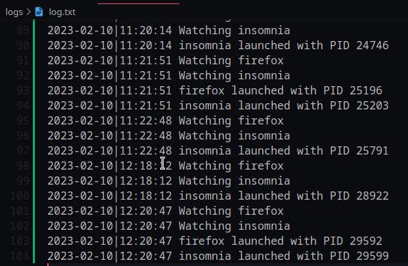
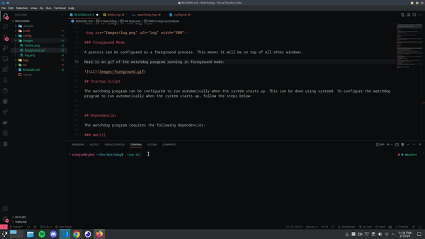
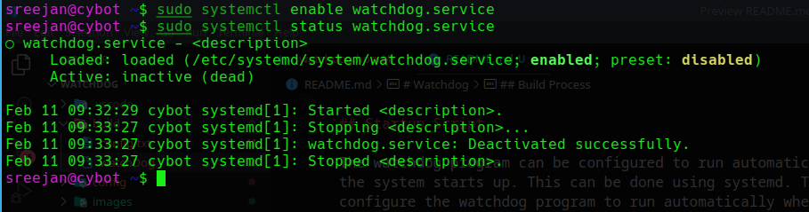

# Watchdog

A Linux watchdog program. A watchdog program is a process that monitors the activity of other processes to ensure they are functioning correctly. If a process being watched fails, the watchdog program will automatically restart it, ensuring the system remains stable.

This watchdog program is a reliable tool for keeping the system running smoothly. It actively monitors specified processes and automatically restarts them if they crash or become unresponsive. This helps to ensure that critical components of the system are always available and functioning properly, reducing downtime and minimizing the risk of data loss.

With this watchdog program, one can rest assured that the system will remain operational even in the face of unexpected failures. Whether someone running a server, a database, or another type of critical service, this tool provides a simple, effective solution for keeping the system up and running.


## Build Process

### Complitation

To compile the watchdog program with gcc, run the following command from the project directory:

```bash
g++ -o build/watchdog src/watchdog.cpp
```

### Execution

To run the watchdog program, run the following command from the project directory:

```bash
./build/watchdog
```

### `run.sh` Script

There is a `run.sh` script in the project directory that can be used to compile and run the watchdog program. To use the script, run the following command from the project directory:

```bash
./run.sh
```

> Note: The `run.sh` script requires the `g++` compiler to be installed on the system. If the `g++` compiler is not installed, the script will not work. Also, the script will need to be made executable before it can be run. To make the script executable, run the following command from the project directory:
>
> ```
> chmod +x run.sh
> ```

## Configuration

## Features

### Process Monitoring

Watchdog monitors the specified processes and automatically restarts them if they crash or become unresponsive. This helps to ensure that critical components of the system are always available and functioning properly, reducing downtime and minimizing the risk of data loss.

Here is an image of the watchdog program running in the background:



> Note: Location for the log file is `<project_directory>/logs/<process_name></process_name>.log`

### Process Restarting

When a process being monitored by the watchdog program crashes or becomes unresponsive, the watchdog program will automatically restart it.

Here is an gif of the watchdog program restarting a process:



### Watchdog Logging

The watchdog program logs all of its activity to a log file. This log file can be used to determine the status of the monitored processes and to troubleshoot any issues that may arise.

Here is an image of the log file:



### Foreground Mode

A process can be configured as a foreground process. This means it will be on top of all other windows.

Here is an gif of the watchdog program running in foreground mode:



## Startup Script

The watchdog program can be configured to run automatically when the system starts up. This can be done using systemd. To configure the watchdog program to run automatically when the system starts up, follow the steps below:

1. Create a service file in the `/etc/systemd/system` directory. The service file should have the following format:

```bash
    [Unit]
    Description=<description>

    [Service]
    ExecStart=<path_to_watchdog_program>

    [Install]
    WantedBy=multi-user.target
```

2. Reload the systemd daemon:

```bash
sudo systemctl daemon-reload
```

3. Enable the service:

```bash
sudo systemctl enable <service_name>
```

4. Start the service:

```bash
sudo systemctl start <service_name>
```

5. Check the status of the service:

```bash

sudo systemctl status <service_name>
```



## Dependencies

The watchdog program requires the following dependencies:

### `wmctrl`

`wmctrl` is a command-line tool for manipulating windows in X. It can be used to set the window state, move and resize windows, get information about windows, and send various kinds of events to windows.

To install `wmctrl`, run the following command:

```bash
sudo apt install wmctrl
```

## Limitations

The watchdog program has the following limitations:

1. Platform: The watchdog program is only supported on Linux systems.
   
2. Process Compatibility: The watchdog program was tested to monitor a very small number of programs. The behavior may not be common for all programs and that is subjected to manual testing.
   
3. No Recusrive Process Monitoring: The watchdog program only monitors the specified processes. It does not monitor the processes that the specified processes spawn.

4. Unit Testing: The watchdog program has not been unit tested. It is possible that some of the watchdog functions may not work properly.

5. Integration Testing: The watchdog program has not been integration tested. It is possible that the watchdog program may not work as expected when monitoring other programs.


## Future Work

The following features could be added to the watchdog program in the future:

1. Cross-Platform Support: The watchdog program could be made compatible with other operating systems, such as Windows and macOS. This would allow the watchdog program to be used on a wider range of systems.

2. User-friendly Interface: The watchdog program could be made more user-friendly by adding a graphical user interface. This would allow users to configure the watchdog program without having to edit configuration files.

3. Process Monitoring: The watchdog program could be made to monitor the processes that the specified processes spawn. This would allow the watchdog program to monitor processes recursively. 
   
4. Unit Testing: The watchdog program could be unit tested. This would allow the watchdog program to be tested in a controlled environment.

5. Integration Testing: The watchdog program could be integration tested. This would allow the watchdog program to be tested in a real-world environment.